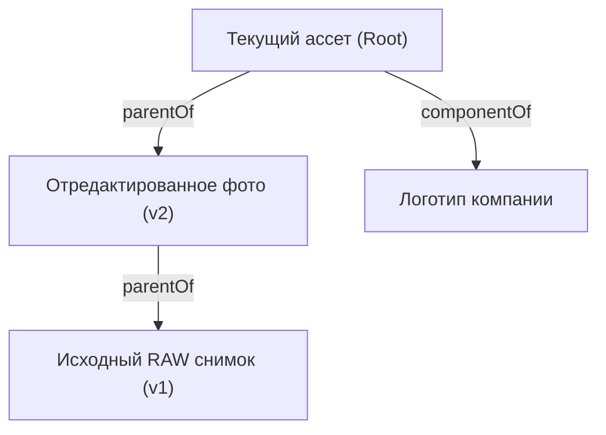

# Архитектура графа происхождения: c2pax Provenance DAG Architecture

Документ описывает структуру графа происхождения C2PA, алгоритмы обхода направленного ациклического графа (DAG) и логику семантического дифференцирования (`c2pax.diff`).

---

## 1. Концепция графа происхождения (DAG)

C2PA связывает манифесты составных и отредактированных медиа-файлов в направленный ациклический граф (Directed Acyclic Graph):
- **Узлы (`ProvenanceNode`)**: отдельные ассеты, ингредиенты или промежуточные версии контента.
- **Рёбра (`ProvenanceEdge`)**: семантические связи между ассетами с типами отношений `Relationship`:
  - `parentOf`: прямое родительское происхождение (оригинал, отредактированная версия).
  - `componentOf`: компонент составного изображения/видео (например, вставка фрагмента).
  - `inputTo`: исходные данные для генерации или трансформации.
- **Действия (`Action`)**: атомарные операции трансформации над ассетом (создание, кадрирование, цветокоррекция, фильтрация, генерация ИИ) с привязкой к ПО и времени.



---

## 2. Модель `ProvenanceGraph`

```python
class ProvenanceGraph:
    root_id: str
    _nodes: dict[str, ProvenanceNode]
    _edges: list[ProvenanceEdge]

    @property
    def root(self) -> ProvenanceNode:
        ...

    @property
    def actions(self) -> list[Action]:
        ...

    def nodes(self) -> Iterable[ProvenanceNode]:
        ...

    def edges(self) -> Iterable[ProvenanceEdge]:
        ...

    def ancestors(self, node_id: str | None = None) -> Iterator[ProvenanceNode]:
        """Итератор по всем предкам в глубину/ширину с защитой от циклов."""
        ...

    def descendants(self, node_id: str | None = None) -> Iterator[ProvenanceNode]:
        ...
```

### Защита от циклов:
При обходе графа ведется множество посещенных идентификаторов `visited: set[str]`. Если в графе обнаруживается цикл, генерируется предупреждение или исключение `CyclicProvenanceError`, предотвращая бесконечную рекурсию.

---

## 3. Семантическое дифференцирование (`c2pax.diff`)

Функция `c2pax.diff(asset1, asset2) -> SemanticDiff` сравнивает нормализованные сущности двух ассетов, абстрагируясь от бинарных различий сериализации CBOR/JUMBF:

### Сравниваемые измерения:
1. **Действия (`added_actions`)**: действия, примененные во втором ассете, которых не было в первом.
2. **Ингредиенты (`added_ingredients`)**: новые связанные компоненты и исходники.
3. **Подписант (`signer_changed`, `previous_signer`, `current_signer`)**: проверка смены автора или инструмента подписи.
4. **ИИ-происхождение (`ai_provenance_changed`)**: появление или изменение генеративных деклараций.
5. **Разрешения (`permissions_changed`)**: изменение флагов Data Mining / AI Training.
6. **Метаданные (`metadata_diff`)**: различия в заголовках, датах и технических атрибутах.
